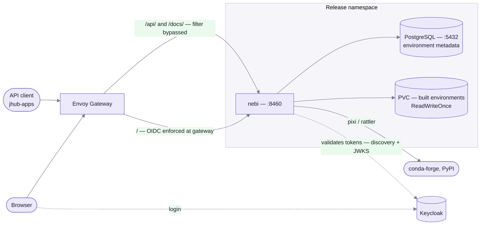

## One service, one hostname

The pack is deliberately small: a single Nebi Deployment, an optional PostgreSQL StatefulSet, a
volume for built environments, and one `NebariApp` that tells the platform all of it exists.

The chart emits exactly one `NebariApp`. The
[nebari-operator](https://github.com/nebari-dev/nebari-operator) turns it into an HTTPRoute, a
certificate, a Keycloak client with its secret, and a landing-page tile — none of which this chart
manages itself.

## Two ways in, one service

The `NebariApp` declares two classes of route, and the difference matters:

- **`routes`** — `/` by default. The gateway enforces OIDC here. A browser hitting the UI is
  redirected to Keycloak, and comes back through oauth2-proxy's `/oauth2/callback` (which is what
  `nebariapp.auth.redirectURI` names).
- **`publicRoutes`** — `/api/` and `/docs/`. These **bypass the gateway's OIDC filter** so that
  bearer-token callers reach Nebi directly instead of being redirected to a login page. "Public"
  means unauthenticated *at the gateway*, not unauthenticated: Nebi validates the bearer token
  itself.

That bypass is what lets the [jhub-apps](https://github.com/nebari-dev/jhub-apps) environment
selector read environments from Nebi's API, and what makes `/docs/` usable as an OpenAPI browser.

## Authentication

Nebi does not run an SSO proxy. It runs with `NEBI_AUTH_TYPE=basic` and validates the OIDC token
the gateway forwards, using a verifier configured from the `auth.oidc.*` values. Enforcement lives
at the gateway (`enforceAtGateway: true`, the operator default).

Authorization is group-based: the `groups` scope is requested for the client, and members of the
groups in `auth.proxyAdminGroups` (`admin,nebi-admin` by default) get Nebi's admin role.

### Token exchange

`nebariapp.auth.tokenExchange.enabled` is on by default. It permits other `NebariApp` clients —
JupyterHub, for instance — to exchange a user's token for one with a Nebi audience. The jhub-apps
environment selector and Nebi's auto-auth both depend on it; without it, a user authenticated to
JupyterHub could not call Nebi's API on their own behalf.

### Split-horizon discovery

The issuer URL is public (`https://keycloak.example.com/realms/nebari`) but pods often cannot
resolve or reach it. So the chart separates the two jobs:

- **`issuerURL`** — what the token's `iss` claim must match. Public.
- **`discoveryURL`** — where Nebi actually fetches `.well-known/openid-configuration`. Defaults to
  the in-cluster Keycloak Service.

Nebi fetches metadata from the second while validating against the first, so token validation
works without the pod ever reaching the public hostname. Details in
[Helm values](/helm-values/#auth-and-oidc).

## State

Two stateful pieces, deliberately separate:

- **PostgreSQL** — environment metadata. Embedded by default as a single-instance StatefulSet;
  disable it with `postgres.enabled=false` to use your own.
- **The environments PVC** — the built environments themselves, mounted at
  `/app/data/environments`. `ReadWriteOnce`, and sized `20Gi` by default.

Three constraints follow from that volume, and they are why the chart looks the way it does:

| Constraint | Consequence |
| --- | --- |
| `ReadWriteOnce` volume | `strategy.type: Recreate` — a rolling update would deadlock on Multi-Attach, because the new pod cannot attach the volume while the old one holds it |
| In-memory queue (`queue.type: memory`) | `replicaCount: 1`; a second replica would have its own, separate queue |
| Both of the above | Expect a brief outage on upgrade rather than a zero-downtime rollout |

## Secret bootstrap

The JWT signing secret and PostgreSQL password are generated by a `secret-init` Job, not by Helm
templating, and the Job is annotated as an ArgoCD `PreSync` hook.

The reason is a known ArgoCD behavior: ArgoCD renders Helm templates client-side, so `lookup()`
always returns nil and `randAlphaNum` would generate fresh credentials on every single sync. No
combination of ArgoCD annotations reliably prevents it (see
[argo-cd#5202](https://github.com/argoproj/argo-cd/issues/5202) and
[argo-cd#8551](https://github.com/argoproj/argo-cd/issues/8551)).

Creating the Secret from an idempotent Job instead means it is not part of the Helm-managed
resource set, so ArgoCD never diffs or overwrites it. The Job checks for the Secret and exits
early if it exists, so upgrades preserve credentials. It runs under its own ServiceAccount with a
Role scoped to `get` and `create` on Secrets in the release namespace.

## Egress

Building an environment means reaching out to conda-forge, PyPI, and sometimes GitHub. On clusters
with a TLS-intercepting egress proxy those requests fail with `unknown CA` until the proxy's CA is
trusted — which is what `orgCABundle.configMapName` is for. It mounts the bundle *and* sets
`SSL_CERT_FILE`, because pixi/rattler use Rust's `rustls-native-certs`, which honors that variable
but does not scan `/etc/ssl/certs/`. See [Helm values](/helm-values/#tls-trust).
